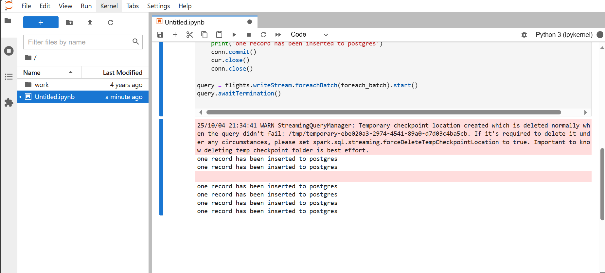
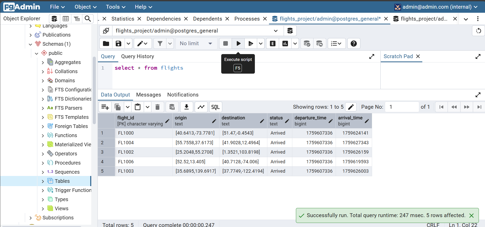
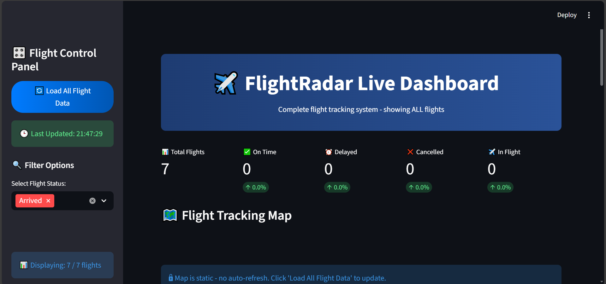
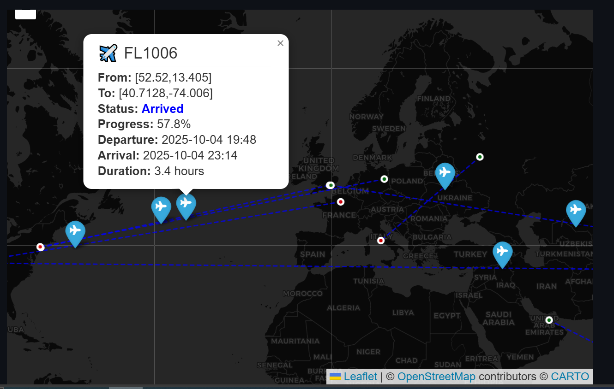

#  Flight Tracking Pipeline - Real-Time Simulation

A **real-time flight tracking system** simulation using a modern data engineering pipeline.  
This project generates fake flight events, streams them through Kafka, processes them with Spark, stores them in PostgreSQL, and visualizes them with a Streamlit dashboard.

---

##  Tools & Technologies

- **Python (Faker)** → Generates fake flight data  
- **Kafka** → Real-time message streaming  
- **Spark (Structured Streaming)** → Processes and transforms flight events  
- **PostgreSQL** → Stores flight data  
- **Streamlit** → Interactive dashboard for visualizing flights  
- **Docker Compose** → Containerized setup for all services  

---

##  Screenshots

### Kafka Producer Running

### Jupyter Notebook - Inserting Records to PostgreSQL

### PostgreSQL Table Query

### Streamlit Dashboard GUI

